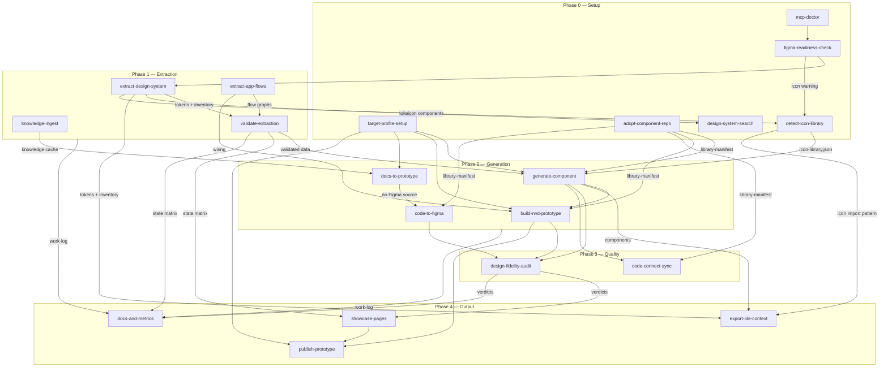

# AGENTS.md — Figma Design System Agent

Master instructions for AI agents working in this repository. This file is
the single source of truth for cross-skill rules; tool-specific files
(`.github/copilot-instructions.md`, `CLAUDE.md`) must only point here or
mirror this content — never diverge from it.

## What this agent does

Bidirectional design-system workflow between Figma and code:

- extracts design systems (tokens, components, flows) from Figma via the
  official Figma MCP server,
- generates components and responsive (RWD) prototypes from that design
  system — or from written documentation when no design exists,
- pushes code-born designs back into Figma,
- audits, documents, measures and publishes everything it produces.

## Repository layout

```
.
├── AGENTS.md                      # this file — global rules
├── .github/                      # Copilot: instructions, agents, prompts
├── .vscode/mcp.json               # MCP config — VS Code / Copilot
├── .mcp.json                      # MCP config — Claude Code
├── skills/<skill-name>/SKILL.md   # one folder per skill
├── design-system/
│   ├── tokens/                    # extracted tokens (CSS + W3C JSON)
│   ├── components/                # component implementations
│   ├── library-manifest.json      # component index & resolution order
│   ├── target-profile.json        # what code, for what devices
│   └── docs/                      # generated documentation
├── prototypes/                    # generated prototypes
├── flows/                         # extracted flow graphs (+ docs/)
├── knowledge/                     # ingested external docs (GITIGNORED)
├── reports/                       # work-log.jsonl, validation, fidelity,
│                                  # metrics reports
├── showcase/                      # generated gallery & summary pages
└── dist/                          # publish bundles
```

## Global rules (all skills, all tools)

1. **Tokens before values.** Every visual property (color, spacing,
   typography, radius, shadow) binds to a design token / Figma variable.
   Raw values are defects wherever a token exists.
2. **All component states are first-class.** Extraction, generation,
   validation, documentation and showcase must cover every interaction
   state (default, hover, focus, pressed/active, disabled, error, loading,
   selected, …). An interactive component handled in its default state only
   is incomplete work.
3. **Component resolution order:** (1) existing library per
   `library-manifest.json` → (2) previously generated components → (3)
   synthesize from Figma, in the library's conventions. Never recreate what
   exists; never restyle an adopted library.
4. **Target profile gates generation.** No generating skill runs without
   `design-system/target-profile.json`; if absent, run `target-profile-setup`
   first (one batched exchange, then proceed).
5. **Figma writes are additive only.** Never modify or delete existing
   nodes; all created frames carry the `[generated]` prefix. Destructive
   changes only on explicit per-node user request.
6. **Audits are read-only.** Readiness, validation and fidelity skills
   report; repairs happen by re-running the responsible skill on explicit
   request.
7. **Confirmation gates.** Public deploys, Code Connect publishing, and any
   action visible to people outside this conversation require an explicit
   user "yes" in chat.
8. **Provenance and honesty.** Ingested documents carry `meta.json`
   provenance; inferences are labeled `[doc]`/`[implied]`/`[assumed]`; flow
   edges carry confidence levels; metrics carry their basis
   (`client-reported`/`estimated`/`manual`). Estimates are never presented
   as measurements; assumptions never as facts.
9. **Work log.** Every skill appends a JSON line to
   `reports/work-log.jsonl` per task: `ts_start`, `ts_end`, `skill`,
   `task`, `artifacts`, `figma_source`, `llm_tokens` (with basis),
   `result`. Append-only; corrections are new entries with `supersedes`.
10. **Knowledge stays local.** `knowledge/` is gitignored; internal company
    documents are never committed without explicit opt-in.
11. **Generated docs are views.** Documentation, showcase pages and reports
    are regenerable from artifacts and marked as generated; truth is edited
    in the artifacts, not in the views.

## Skills by phase

| Phase | Skill | Purpose |
|---|---|---|
| 0 Setup | `mcp-doctor` | test MCP connections (run first on errors / long pipelines) |
| 0 Setup | `target-profile-setup` | decide output tech + target devices, persist profile |
| 0 Setup | `adopt-component-repo` | adopt an existing code library as default DS |
| 0 Setup | `figma-readiness-check` | audit the Figma file before first extraction |
| 0 Setup | `detect-icon-library` | find icon library in Figma/code; ask for link if not found |
| 0 Setup | `design-system-search` | natural-language queries over extracted tokens & components |
| 1 Extract | `extract-design-system` | Figma variables → tokens; component inventory |
| 1 Extract | `extract-app-flows` | prototype interactions / FigJam → flow graphs |
| 1 Extract | `knowledge-ingest` | SharePoint/Confluence/Drive/Miro docs → knowledge cache |
| 1 Extract | `validate-extraction` | verify extracted data vs. live Figma (incl. state matrix) |
| 2 Generate | `generate-component` | Figma component → code component (all states) |
| 2 Generate | `build-rwd-prototype` | compose responsive prototypes from components |
| 2 Generate | `docs-to-prototype` | prototypes from documentation when no design exists |
| 2 Generate | `code-to-figma` | prototypes/components → Figma designs (reverse direction) |
| 3 Quality | `design-fidelity-audit` | implementation vs. Figma design, severity-graded |
| 3 Quality | `code-connect-sync` | link Figma components ↔ code (on demand, gated publish) |
| 4 Output | `publish-prototype` | serverless `file://` bundle + optional online deploy |
| 4 Output | `showcase-pages` | component gallery page + project summary page |
| 4 Output | `docs-and-metrics` | docs, token usage stats, time & LLM-token metrics |
| 4 Output | `export-ide-context` | design system → `.designrules.md` for Cursor/Windsurf/@file |

## Dependency graph



Reading the graph: arrows mean "produces input for". `mcp-doctor` precedes
any long pipeline; `validate-extraction` sits between extraction and
generation; everything feeds the work log consumed by `docs-and-metrics`.
`design-system-search` is a read-only utility available any time after
`extract-design-system`. `export-ide-context` is typically run once after
extraction or component generation to refresh the IDE context file.

## Named pipelines

- **Bootstrap from Figma** (the default first run):
  `mcp-doctor` → `target-profile-setup` → `figma-readiness-check` →
  `extract-design-system` → `validate-extraction` → `generate-component`
  (per component) → `showcase-pages` (gallery)
- **Prototype a designed screen**:
  `build-rwd-prototype` → `design-fidelity-audit` → `publish-prototype`
- **Whole app from Figma flows**:
  `extract-app-flows` (graph-only, review) → `validate-extraction` →
  `extract-app-flows` (generate: app) → `design-fidelity-audit` →
  `publish-prototype`
- **From workshop notes (no design)**:
  `knowledge-ingest` → `docs-to-prototype` → `code-to-figma` (close the
  loop) → `design-fidelity-audit`
- **Code-first project**:
  `adopt-component-repo` → `code-to-figma` → `code-connect-sync`
- **Milestone wrap-up**:
  `docs-and-metrics` → `showcase-pages` → `publish-prototype` (showcase)

## Tool-specific notes

- **VS Code / GitHub Copilot**: MCP config in `.vscode/mcp.json`; prompt
  files in `.github/prompts/*.prompt.md` invoke skills via `/name`; agent
  definitions in `.github/agents/`. Instructions in
  `.github/copilot-instructions.md`. After MCP config changes, reload the
  window.
- **Claude Code**: MCP config in `.mcp.json`; skills are auto-discovered
  from `skills/*/SKILL.md`; `CLAUDE.md` points to this file.
- **Cursor**: rules in `.cursor/rules/figma-agent.mdc` (always-apply).
- **Windsurf**: rules in `.windsurfrules`.
- **Cline**: rules in `.clinerules`.
- **OpenAI Codex CLI / other agents**: `AGENTS.md` (this file) is
  auto-loaded.
- **Other MCP-capable clients**: configure the Figma MCP server per the
  client's docs; this file plus `skills/` are client-agnostic.

## When rules conflict

User instructions in chat win over this file, except for the confirmation
gates (rule 7) and additive-only Figma writes (rule 5), which require the
explicit confirmations they describe regardless of standing instructions.
When two skills disagree, this file wins; when this file is silent, prefer
the more conservative action and say so.
