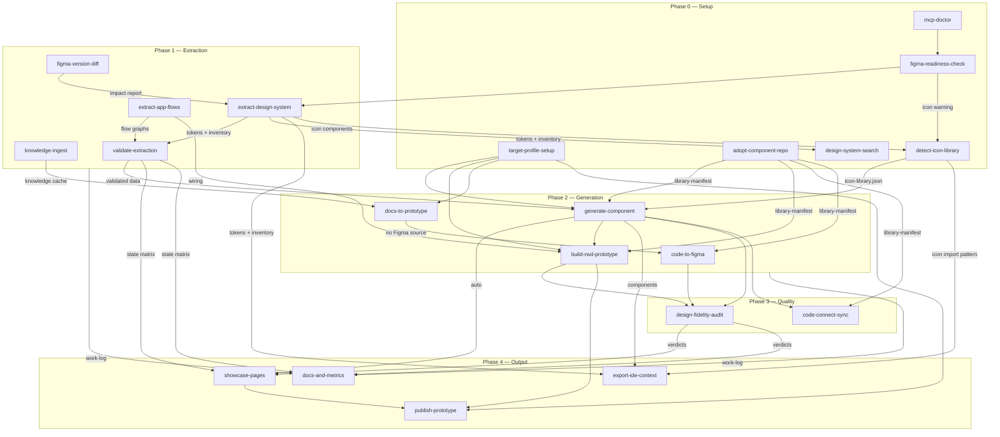

# AGENTS.md — Figma Design System Agent

Master instructions for AI agents working in this repository. This file is
the single source of truth for cross-skill rules; tool-specific files
(`.github/copilot-instructions.md`, `CLAUDE.md`) must only point here or
mirror this content — never diverge from it.

## What this agent does

Bidirectional design-system workflow between Figma and code:

- extracts design systems (tokens, components, flows) from Figma via the
  official Figma MCP server,
- generates components and responsive (RWD) prototypes from that design
  system — or from written documentation when no design exists,
- pushes code-born designs back into Figma,
- audits, documents, measures and publishes everything it produces.

## Figma connection modes

The agent can reach Figma through four different mechanisms. Choose the one
that fits your setup; everything else in the workflow stays the same.

| Mode | Cost | Requires | Read/Write | Best for |
|------|------|----------|-----------|----------|
| **Remote MCP** `mcp.figma.com` | OAuth token (may need paid plan) | Figma OAuth token | Read-only | CI/CD, cloud agents, no desktop |
| **Local MCP** `127.0.0.1:3845` | Free | Figma desktop app + Dev Mode MCP enabled | Read-only | Local development, no token needed |
| **Community MCP** (EXDST) | Free, open source | Figma plugin + local server running | Read **+** Write | When you need `code-to-figma` or `code-connect-sync` without a paid plan |
| **REST API** (wizard only) | Free | Personal Access Token (PAT) | Read-only | Non-Anthropic AI providers; no MCP server available |

### Switching between Remote and Local MCP

Both `.mcp.json` (Claude Code) and `.vscode/mcp.json` (VS Code / Copilot)
contain two entries — one for each mode. Comment out the one you are not
using and uncomment the other, then restart your client.

```jsonc
// .mcp.json — uncomment the mode you want:
{
  "mcpServers": {
    // "figma-local": { "url": "http://127.0.0.1:3845/mcp" },
    "figma-remote": { "url": "https://mcp.figma.com/mcp" }
  }
}
```

**Local MCP setup** (one-time):
1. Install the Figma desktop app (free — figma.com/downloads)
2. Open Figma → Preferences → Enable Dev Mode MCP Server
3. Switch `.mcp.json` to the local entry and restart your AI client
4. Run `mcp-doctor` to verify — you should see a green local-server row

### Community MCP (EXDST) — free read+write alternative

The [EXDST community MCP server](https://github.com/exdst/figma-mcp) runs
locally via a Figma plugin and a WebSocket bridge. It exposes the same
MCP tool interface as the official server but also allows write operations.
Use it when you need `code-to-figma` or `code-connect-sync` without a
remote OAuth token.

**Setup:**
1. Clone the repo: `git clone https://github.com/exdst/figma-mcp`
2. Follow the repo's README to install the Figma plugin and start the server
3. Note the local URL the server reports (typically `ws://localhost:{port}`)
4. Update `.mcp.json` to point to that URL and restart your AI client

### REST API mode (wizard only)

When running the web wizard without an MCP server, the wizard can fetch
design data directly from the Figma REST API using the Personal Access
Token collected in Step 1. This mode activates automatically when a
non-Anthropic AI provider is selected, or manually via the "Use REST API"
option in the wizard's Figma connection modal.

Limitations of REST mode: read-only (no `code-to-figma` or
`code-connect-sync`); no live node screenshots; slightly reduced accuracy
on `figma-readiness-check`.

## Repository layout

```
.
├── AGENTS.md                      # this file — global rules
├── .github/                      # Copilot: instructions, agents, prompts
├── .vscode/mcp.json               # MCP config — VS Code / Copilot
├── .mcp.json                      # MCP config — Claude Code
├── skills/<skill-name>/SKILL.md   # one folder per skill
├── design-system/
│   ├── tokens/                    # extracted tokens (CSS + W3C JSON)
│   ├── components/                # component implementations
│   ├── library-manifest.json      # component index & resolution order
│   ├── target-profile.json        # what code, for what devices
│   └── docs/                      # generated documentation
├── prototypes/                    # generated prototypes
├── flows/                         # extracted flow graphs (+ docs/)
├── knowledge/                     # ingested external docs (GITIGNORED)
├── reports/                       # work-log.jsonl, validation, fidelity,
│                                  # metrics reports
├── showcase/                      # generated gallery & summary pages
└── dist/                          # publish bundles
```

## Global rules (all skills, all tools)

1. **Tokens before values.** Every visual property (color, spacing,
   typography, radius, shadow) binds to a design token / Figma variable.
   Raw values are defects wherever a token exists.
2. **All component states are first-class.** Extraction, generation,
   validation, documentation and showcase must cover every interaction
   state (default, hover, focus, pressed/active, disabled, error, loading,
   selected, …). An interactive component handled in its default state only
   is incomplete work.
3. **Component resolution order:** (1) existing library per
   `library-manifest.json` → (2) previously generated components → (3)
   synthesize from Figma, in the library's conventions. Never recreate what
   exists; never restyle an adopted library.
4. **Target profile gates generation.** No generating skill runs without
   `design-system/target-profile.json`; if absent, run `target-profile-setup`
   first (one batched exchange, then proceed).
5. **Figma writes are additive only.** Never modify or delete existing
   nodes; all created frames carry the `[generated]` prefix. Destructive
   changes only on explicit per-node user request.
6. **Audits are read-only.** Readiness, validation and fidelity skills
   report; repairs happen by re-running the responsible skill on explicit
   request.
7. **Confirmation gates.** Public deploys, Code Connect publishing, and any
   action visible to people outside this conversation require an explicit
   user "yes" in chat.
8. **Provenance and honesty.** Ingested documents carry `meta.json`
   provenance; inferences are labeled `[doc]`/`[implied]`/`[assumed]`; flow
   edges carry confidence levels; metrics carry their basis
   (`client-reported`/`estimated`/`manual`). Estimates are never presented
   as measurements; assumptions never as facts.
9. **Work log.** Every skill appends a JSON line to
   `reports/work-log.jsonl` per task: `ts_start`, `ts_end`, `skill`,
   `task`, `artifacts`, `figma_source`, `llm_tokens` (with basis),
   `result`. Append-only; corrections are new entries with `supersedes`.
10. **Knowledge stays local.** `knowledge/` is gitignored; internal company
    documents are never committed without explicit opt-in.
11. **Generated docs are views.** Documentation, showcase pages and reports
    are regenerable from artifacts and marked as generated; truth is edited
    in the artifacts, not in the views.
12. **Model tier by task shape.** Three tiers; Sonnet is the fallback when
    a skill doesn't clearly belong to the other two:
    - **Opus-class** (Claude Opus 5, or the strongest reasoning/vision-
      capable model in a non-Claude tool) — skills whose core work is
      scanning/interpreting images (Figma screenshots, visual diffing) or
      open-ended multi-step planning (architecture/adoption decisions,
      generation from ambiguous docs).
    - **Haiku-class** (Claude Haiku 4.5, or the fastest/cheapest model in a
      non-Claude tool) — skills whose core work is mechanical and
      low-judgment: running predefined checks, packaging/deploying
      artifacts, or templating already-produced structured data into a
      fixed output format, with no interpretive or comparative judgment
      involved.
    - **Sonnet-class** (Claude Sonnet 5, or the equivalent mid-tier model)
      — text/structured-data review, checking code or naming against a
      spec, and anything not clearly mechanical enough for Haiku or
      visual/open-ended enough for Opus.

    Assignments are in the `Model` column below; switch models — or
    dispatch a subagent pinned to the right tier where the tool supports
    it (e.g. Claude Code's `.claude/agents/*.md` `model:` field) — before
    running a skill that calls for a different tier.
13. **Greenfield pages get a craft layer, not a free-for-all.** When a
    page-generation request has no Figma-sourced design system yet for
    this project (`design-system/tokens/` empty, `extract-design-system`
    never run) — this is `docs-to-prototype`'s normal case — check whether
    the `interface-design` skill/plugin is available
    (`~/.claude/skills/interface-design`, `.claude/skills/interface-design`,
    or the Claude Code plugin `Dammyjay93/interface-design`). If present,
    use it as the default builder for page-level craft decisions the
    absent DS can't supply — hierarchy, spacing rhythm, depth — recorded in
    its own `.interface-design/system.md`. If absent, propose installing it
    once per project (not on every run):
    `npx skills add https://github.com/Dammyjay93/interface-design --skill interface-design --agent claude-code -g`
    (or `/plugin marketplace add Dammyjay93/interface-design` via Claude
    Code's plugin flow). The moment a real Figma DS exists for the
    project, this rule stops applying: `build-rwd-prototype`'s DS-only
    rules (rules 1 and 3) take back over, and `interface-design` never
    overrides a token or component that already exists.

## Skills by phase

| Phase | Skill | Purpose | Model |
|---|---|---|---|
| 0 Setup | `mcp-doctor` | test MCP connections (run first on errors / long pipelines) | Haiku |
| 0 Setup | `target-profile-setup` | decide output tech + target devices, persist profile | Sonnet |
| 0 Setup | `adopt-component-repo` | adopt an existing code library as default DS | Opus |
| 0 Setup | `figma-readiness-check` | audit the Figma file before first extraction | Opus |
| 0 Setup | `detect-icon-library` | find icon library in Figma/code; ask for link if not found | Opus |
| 0 Setup | `design-system-search` | natural-language queries over extracted tokens & components | Sonnet |
| 1 Extract | `figma-version-diff` | diff live Figma vs. last extraction; changelog before re-run | Opus |
| 1 Extract | `extract-design-system` | Figma variables → tokens (CSS/SCSS/TS/Tailwind); component inventory | Opus |
| 1 Extract | `extract-app-flows` | prototype interactions / FigJam → flow graphs | Opus |
| 1 Extract | `knowledge-ingest` | SharePoint/Confluence/Drive/Miro docs → knowledge cache | Sonnet |
| 1 Extract | `validate-extraction` | verify extracted data vs. live Figma (incl. state matrix) | Opus |
| 1.5 Align | `ds-naming-audit` | detect & document naming mismatches Figma ↔ code; write alias map | Sonnet |
| 1.5 Align | `ds-gap-analysis` | 3-bucket coverage report: Figma-only / Code-only / Both | Sonnet |
| 1.5 Align | `ds-checklist` | generate & manage prioritised DS alignment task list | Sonnet |
| 2 Generate | `generate-component` | Figma component → code component (all states) | Opus |
| 2 Generate | `build-rwd-prototype` | compose responsive prototypes from components | Opus |
| 2 Generate | `docs-to-prototype` | prototypes from documentation when no design exists | Opus |
| 2 Generate | `code-to-figma` | prototypes/components → Figma designs (reverse direction) | Opus |
| 3 Quality | `design-fidelity-audit` | implementation vs. Figma design, severity-graded | Opus |
| 3 Quality | `code-connect-sync` | link Figma components ↔ code (on demand, gated publish) | Sonnet |
| 4 Output | `publish-prototype` | serverless `file://` bundle + optional online deploy | Haiku |
| 4 Output | `showcase-pages` | component gallery page + project summary page | Haiku |
| 4 Output | `docs-and-metrics` | docs, token usage stats, time & LLM-token metrics | Sonnet |
| 4 Output | `export-ide-context` | design system → `.designrules.md` for Cursor/Windsurf/@file | Haiku |

## Dependency graph



Reading the graph: arrows mean "produces input for". `mcp-doctor` precedes
any long pipeline; `validate-extraction` sits between extraction and
generation; everything feeds the work log consumed by `docs-and-metrics`.
`generate-component` auto-regenerates `showcase-pages` after every build
(dashed `auto` edge) — direct invocation of `showcase-pages` is for forced
refresh or the project-summary page only. `figma-version-diff` is an
on-demand read-only check run before re-extraction to understand the scope
of designer changes; its impact report feeds `extract-design-system` in
update mode. `design-system-search` is a read-only utility available any
time after `extract-design-system`. `export-ide-context` is typically run
once after extraction or component generation to refresh the IDE context file.

## Named pipelines

- **Bootstrap from Figma** (the default first run):
  `mcp-doctor` → `target-profile-setup` → `figma-readiness-check` →
  `detect-icon-library` → `extract-design-system` → `validate-extraction`
  → `generate-component` (per component; showcase auto-regenerated each
  time) → `export-ide-context` (optional, for IDE @file context)
- **Update after designer changes**:
  `figma-version-diff` (scope the changes) → `extract-design-system`
  (update mode) → `validate-extraction` → `generate-component` (affected
  components only)
- **Prototype a designed screen**:
  `build-rwd-prototype` → `design-fidelity-audit` → `publish-prototype`
- **Whole app from Figma flows**:
  `extract-app-flows` (graph-only, review) → `validate-extraction` →
  `extract-app-flows` (generate: app) → `design-fidelity-audit` →
  `publish-prototype`
- **From workshop notes (no design)**:
  `knowledge-ingest` → `docs-to-prototype` → `code-to-figma` (close the
  loop) → `design-fidelity-audit`
- **Code-first project**:
- **DS alignment sprint** (existing Figma DS + existing codebase):
  `ds-naming-audit` (resolve aliases) → `ds-gap-analysis` (3-bucket coverage) →
  `ds-checklist` (generate task list) → `generate-component` (Bucket A items) →
  `code-to-figma` (Bucket B items) → `design-fidelity-audit` (Bucket C items)
  `adopt-component-repo` → `code-to-figma` → `code-connect-sync`
- **Milestone wrap-up**:
  `docs-and-metrics` → `showcase-pages` → `publish-prototype` (showcase)

## Tool-specific notes

- **VS Code / GitHub Copilot**: MCP config in `.vscode/mcp.json`; prompt
  files in `.github/prompts/*.prompt.md` invoke skills via `/name`; agent
  definitions in `.github/agents/`. Instructions in
  `.github/copilot-instructions.md`. After MCP config changes, reload the
  window.
- **Claude Code**: MCP config in `.mcp.json`; skills are auto-discovered
  from `skills/*/SKILL.md`; `CLAUDE.md` points to this file.
- **Cursor**: rules in `.cursor/rules/figma-agent.mdc` (always-apply).
- **Windsurf**: rules in `.windsurfrules`.
- **Cline**: rules in `.clinerules`.
- **OpenAI Codex CLI / other agents**: `AGENTS.md` (this file) is
  auto-loaded.
- **Other MCP-capable clients**: configure the Figma MCP server per the
  client's docs; this file plus `skills/` are client-agnostic.

## When rules conflict

User instructions in chat win over this file, except for the confirmation
gates (rule 7) and additive-only Figma writes (rule 5), which require the
explicit confirmations they describe regardless of standing instructions.
When two skills disagree, this file wins; when this file is silent, prefer
the more conservative action and say so.
